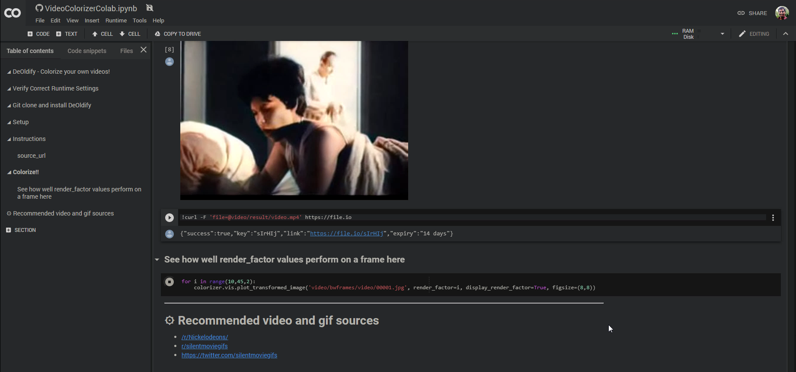

# Uipath Deoldify
A UiPath RPA bot to automatically convert your old B&W videos to colorized format. This project is based on the [Deoldify](https://github.com/jantic/DeOldify) by [Jason Antic](https://twitter.com/citnaj) and uses Google Colab for code execution.

To run this project you need to have 
1. Uipath installed along with the required extension.
2. Chrome Browser
3. Logged in into your Google account in chrome. (to use colab)

Once you run the project, you will have to enter a Youtube (or [other sites](https://ytdl-org.github.io/youtube-dl/supportedsites.html)) url into the dialog. The colorized video will be stored in your downloads folder with name *result.mp4*.

